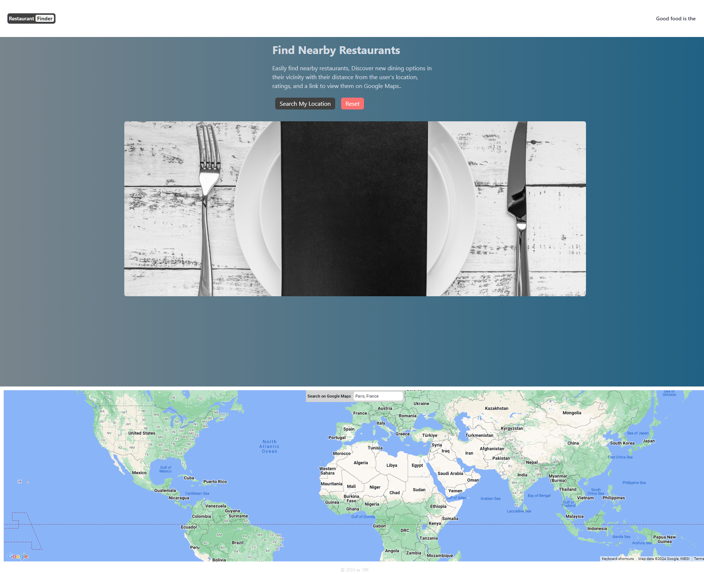
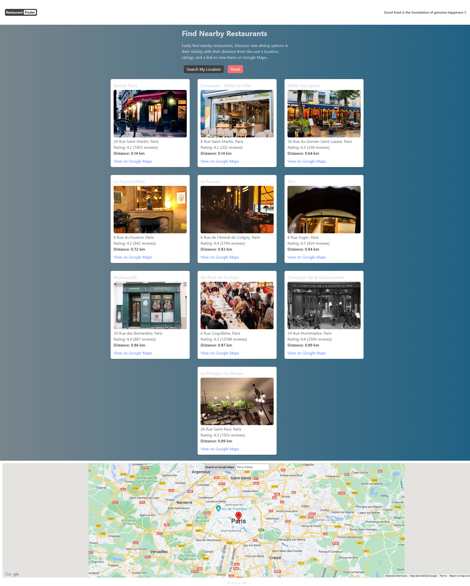

# Restaurant Finder

Restaurant Finder is a single-page application (SPA) that allows users to find nearby restaurants based on their current location or a selected place using the Google Places API.
The app provides a list of restaurants with their distance from the user's location, ratings, and a link to view them on Google Maps.

## Use Case

Easily find nearby restaurants, Discover new dining options in their vicinity.

## Features

- Nearby Restaurants: Displays a list of 10 nearby restaurants with distances in kilometers.
- Google Maps Integration: Includes a map with a marker for the user's location.
- Autocomplete Search: Allows users to search for locations using Google Places Autocomplete.
- Type Animations: Dynamic text animations in the header for enhanced user experience.
- Reset Functionality: Clear the map and search results with a reset button.
- Restaurant Details: Shows restaurant name, vicinity, rating, user ratings, and a link to Google Maps.
- DaisyUI Integration: Utilizes DaisyUI, a popular component library for Tailwind CSS, for enhanced UI components such as a visually appealing hero section.

## Tech Stack

- **Frontend:**

  - **React (TypeScript):**
  - **Redux Toolkit:**
  - **Tailwind CSS:**
  - **DaisyUI:**
  - **React Google Maps:**
  - **React Type Animation:**

- **Backend:**
  - **Express.js:**
  - **Axios:**

## Project Structure

```plaintext
client
├── src/
│   ├── components/
│   │   ├── Footer.tsx
│   │   ├── Header.tsx
│   │   ├── PlaceAutocomplete.tsx
│   │   ├── RestaurantItem.tsx
│   │   ├── RestaurantList.tsx
│   ├── images/
│   │   ├── def-restaurant.jpg
│   │   ├── menuplate.jpg
│   ├── redux/
│   │   ├── hooks.ts
│   │   ├── store.ts
│   │   ├── restaurantsSlice.ts
│   ├── App.tsx
│   ├── index.tsx
│   ├── .env
│   ├── package.json
server
├── server.js
├── .env
```




### Components and State Management

#### Components

- **Header.tsx**: Displays the application title and an animated subtitle.
- **Footer.tsx**: Displays the footer with the current year.
- **PlaceAutocomplete.tsx**: Provides a search box for users to enter a location using Google Places Autocomplete.
- **RestaurantItem.tsx**: Displays individual restaurant details including name, vicinity, rating, distance, and a link to Google Maps.
- **RestaurantList.tsx**: Main component that fetches and displays a list of nearby restaurants.

#### Redux Store

- **hooks.ts**: Contains custom hooks (`useAppDispatch` and `useAppSelector`) for using Redux in the application.
- **restaurantsSlice.ts**: Defines the restaurant slice with async thunk for fetching restaurant data and reducers for handling state.
- **store.ts**: Configures the Redux store with the restaurant slice.

#### Google Places API Integration

- The backend server (`server.js`) handles API requests to the Google Places API to fetch nearby restaurants based on the user's coordinates.
- The response data is processed to include only the necessary information such as name, vicinity, rating, user ratings total, distance, and photo URL.
- The frontend component `RestaurantList.tsx` dispatches the `fetchRestaurants` thunk to fetch and display the list of restaurants.

### Configuration and Setup

- **Clone the Repository:**

  ```bash
  git clone <repository-url>
  ```

  - **`cd restaurant-finder`**

- **Setup Environment Variables:**
  REACT_APP_GOOGLE_PLACES_API_KEY=your_google_places_api_key
  REACT_APP_MAP_ID=your_map_id

- **Google API Configuration**
  Google Places API:
  Follow the Google Places API documentation to set up and get API key.
  Google Maps API:
  Follow the Google Maps API documentation to set up and get API key.

- **Install Dependencies & Run the App:**
- **`npm install`**
- **` cd client`**
- **` npm install`**
- **` cd ../server`**
- **` npm install`**

##### Start the backend server

- **`cd server`**
- **`npm start`**

##### Start the frontend client

- **`cd client`**
- **`npm start`**